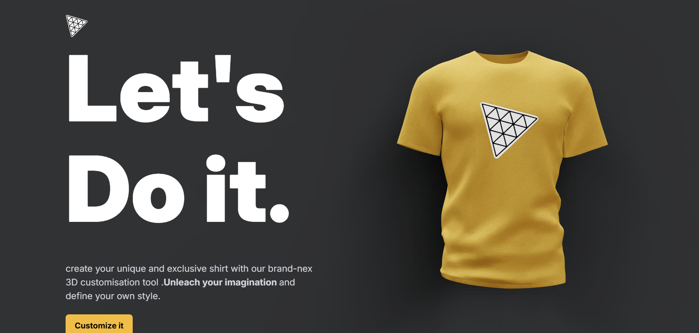
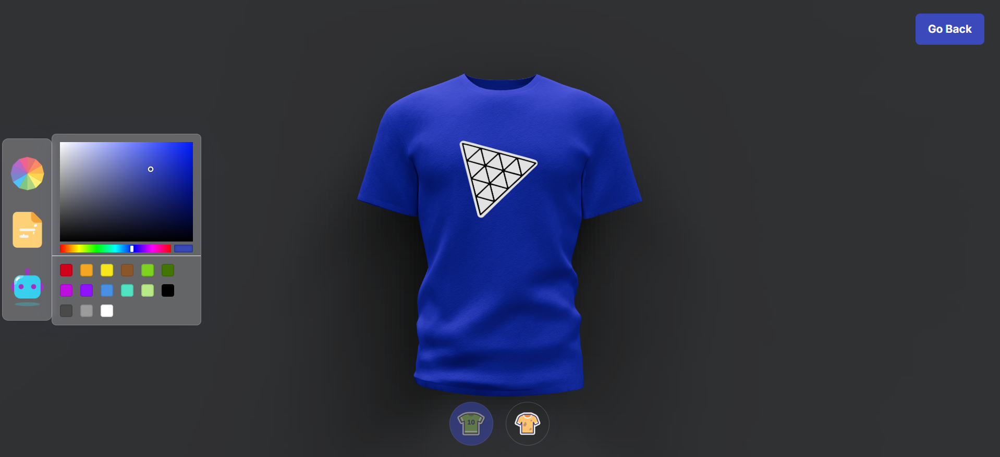

# 🎨 3D Model Customizer with Next.js

This mini-project was created to get familiar with **Next.js** and modern web development tools.  
It showcases an **interactive 3D model** that users can customize in different ways:

- 🖌️ Change the **color** of the model in real-time  
- 🖼️ Upload an **image** to apply it as a **logo/texture** on the model  
- 🤖 Use a simple **AI-powered customization assistant** to generate new styles automatically  

---

## 🚀 Features
- Built with **Next.js 14**  
- 3D rendering powered by **Three.js** and **@react-three/fiber**  
- State management with **Valtio**  
- Responsive design with **Tailwind CSS**  
- AI integration for smart customization  

---

## 📸 Screenshot

  

---

  

---

## 📂 Project Structure
/components -> React components (3D model, UI controls, etc.)

/pages -> Next.js pages

/public -> Static assets (images, logos, textures)

/styles -> Tailwind CSS styles

## 🎯 Goals of the Project

Learn and practice Next.js fundamentals

Experiment with 3D rendering in React

Understand state management with Valtio

Explore how to integrate AI features into a web app

